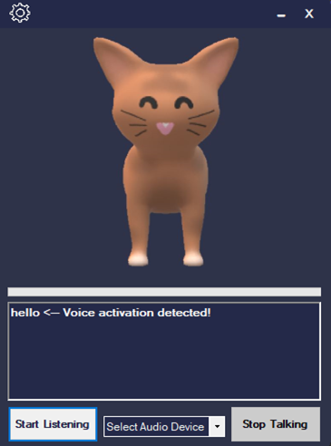
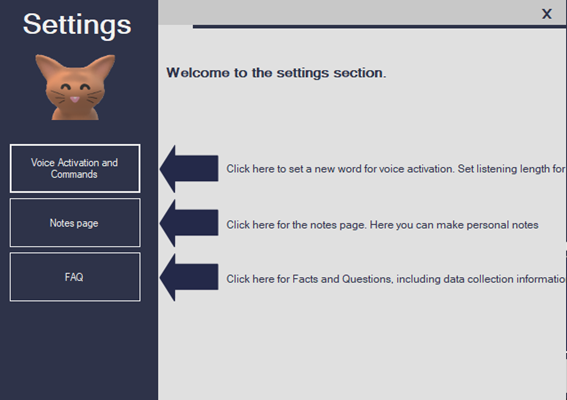
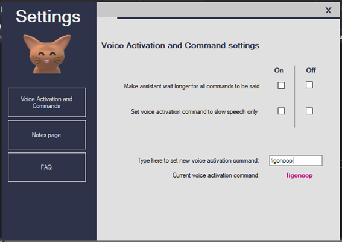
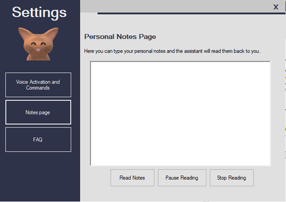

# Cat Virtual Assistant 
### Using C#, .NET Framework, and Windows Forms
 

The assistant has the ability to perform basic tasks and was created for my university project titled: **'Investigating the modes of interaction with AI personal assistants that create user embarrassment.'**
  
The assistant is designed in such a way to combat the embarrassment users may feel when talking to a machine.

---
 

 

Key Features: 
* The assistant can recognise 21 commands; designed to give the user ease of access, productivity, and entertainment. 
* Users can set a custom word or phrase for voice activation. 
* Users can select an option where the assistant will wait longer for them to speak before processing a command. 
* Users can have the assistant read back their notes to them. The assistant will prompt the user to confirm whether they are sure they want the assistant to do this.
* The presence of the cat, and the audio bar (the white bar directly underneath the cat which moves when the assistant talks) are both implementations from the findings of a Japanese research paper into user embarrassment. Apparently, users can feel less embarrassment when talking to a virtual animal, so long as it still looks like a smart device.
      
### Below is the view of the settings pages
---
 
 
(The small cat on the left plays a meow sound when clicked :smiley_cat: )
 
 

